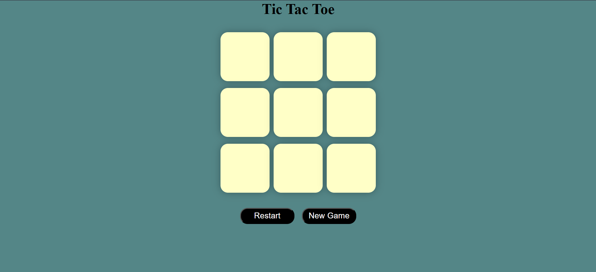

# Tic Tac Toe Game

A classic Tic Tac Toe game developed using HTML, CSS, and JavaScript. Players can take turns placing their marks on the board, and the game automatically detects winners and draws.

## Features
- Two-player gameplay
- Interactive game board
- Automatic winner detection
- Draw detection
- Restart/new game functionality
- Responsive design

## Technologies Used
- HTML5
- CSS3
- JavaScript

## Purpose
This project was created to improve JavaScript programming skills by implementing game logic, DOM manipulation, and user interactions.

## Project Screenshot

## Author
Nidhi Soni
